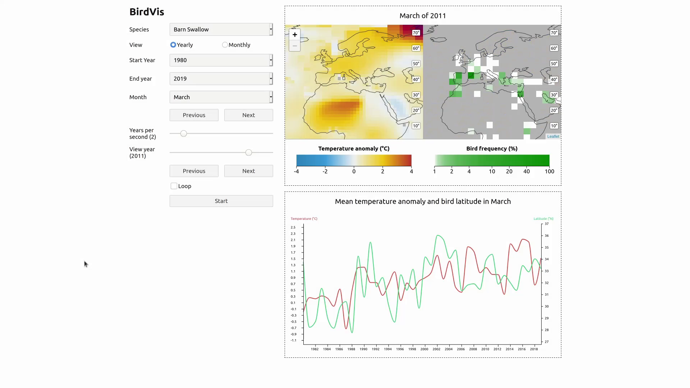

# 🐦 BirdVis

[**View the screencast**](https://youtu.be/61UDH47zNUM)

## Installation

1. Install [Node.js](https://nodejs.org/) v12 or higher.
2. Open the `app` directory in a terminal.
2. Install the project dependencies with `npm install`.

## Usage

Ensure you are in the `app` directory before running `npm` commands.

### Development

Run `npm run dev` and go to http://localhost:5000 in your browser.

When you make a change to the code, the app will update automatically.

When you commit a change, your code will automatically be formatted. You can also run the formatter manually with `npm run format`.

### Production

To create a production build, run `npm run build`.

To start the production build, run `npm start`.
